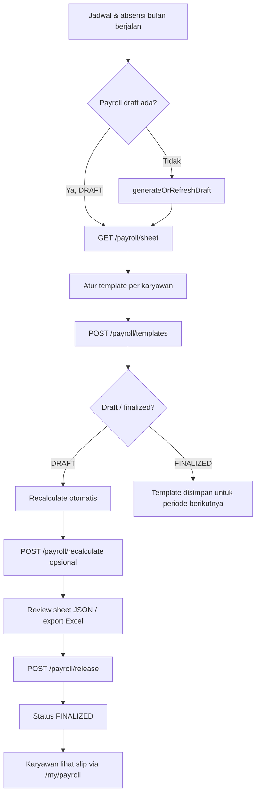

# Dokumentasi Fitur Payroll & TER Bracket

Dokumen ini menjelaskan alur kerja fitur payroll bulanan, mekanisme perhitungan (selaras dengan sheet Excel `01. Januari 26` + tab `TER`), struktur data `payroll_ter_brackets`, serta seluruh API yang aktif terdaftar di `routes/api.php`.

---

## Daftar Isi

1. [Ringkasan](#ringkasan)
2. [Komponen Sistem](#komponen-sistem)
3. [Alur Kerja](#alur-kerja)
4. [Tabel TER Bracket](#tabel-ter-bracket)
5. [Rumus Perhitungan Payroll](#rumus-perhitungan-payroll)
6. [Template Komponen per Karyawan](#template-komponen-per-karyawan)
7. [Otorisasi](#otorisasi)
8. [API Reference](#api-reference)
9. [Contoh Body Postman](#contoh-body-postman)
10. [Cron & Perintah Artisan](#cron--perintah-artisan)
11. [Struktur Database](#struktur-database)
12. [Catatan Teknis](#catatan-teknis)

---

## Ringkasan

Fitur payroll menghitung gaji bulanan per karyawan dalam satu project berdasarkan:

- **Schedule sheet** (`ScheduleSheetService`) — sumber metrik absensi: HK, OT, SAKIT, IZIN, CUTI, ALPA, SOC-A, jumlah schedule.
- **Payroll policy** (`payroll_policies`) — tarif dasar opsional (mis. `daily_rate`).
- **Payroll user template** (`payroll_user_templates`) — komponen manual per karyawan (gaji pokok, BPJS, potongan, status PTKP, dll.).
- **TER bracket** (`payroll_ter_brackets`) — tarif PPh21 berdasarkan kategori A/B/C dan penghasilan bruto pajak.

Hasil perhitungan disimpan sebagai **snapshot** di `payroll_runs` + `payroll_details`. Status run:

| Status | Keterangan |
|--------|------------|
| `DRAFT` | Boleh dihitung ulang, template bisa mengubah nilai |
| `FINALIZED` | Dirilis (`released_at`), snapshot terkunci |
| `PAID` | Sudah dibayar (legacy flow) |
| `CANCELLED` | Dibatalkan (legacy flow) |

Karyawan hanya bisa melihat payroll dengan status **`FINALIZED`** melalui endpoint `/my/payroll/*`.

---

## Komponen Sistem

| Layer | File / Tabel | Peran |
|-------|--------------|-------|
| Controller | `app/Http/Controllers/Api/PayrollController.php` | Endpoint utama payroll |
| Service | `app/Services/PayrollService.php` | Generate draft, hitung, sheet, export |
| Service | `app/Services/ScheduleSheetService.php` | Agregasi jadwal & absensi per bulan |
| Model | `PayrollRun`, `PayrollDetail`, `PayrollUserTemplate` | Data payroll |
| Model | `PayrollTerBracket` | Referensi tarif TER |
| Policy | `PayrollRunPolicy`, `PayrollDetailPolicy` | Kontrol akses |
| Migration | `2026_05_05_150000_create_payroll_ter_brackets_table.php` | Buat & seed tabel TER |
| Config | `config/payroll.php` | Default overtime rate, dll. |
| Cron | `payroll:prepare-drafts` | Auto-generate draft harian |

> **Catatan:** Controller legacy `PayrollRunController`, `PayrollPolicyController`, dan `PayrollDetailController` masih ada di codebase (`API_ROUTES_PAYROLL.php`) tetapi **belum terdaftar** di `routes/api.php`. Flow produksi saat ini memakai `PayrollController` + `PayrollService`.

---

## Alur Kerja

### Diagram alur admin (HO / Dev)



### Langkah operasional

1. **Persiapan data** — Pastikan schedule bulan target sudah lengkap dan absensi tercatat.
2. **Generate draft** — Otomatis via cron `payroll:prepare-drafts` atau saat pertama kali memanggil `GET /projects/{project}/payroll/sheet?month=YYYY-MM`.
3. **Isi template karyawan** — POST komponen gaji (gaji pokok, BPJS, potongan, PTKP) via `/payroll/templates`.
4. **Review** — GET sheet untuk melihat kolom penambah/pengurang/PPh/THP per baris karyawan.
5. **Recalculate** (opsional) — POST `/payroll/recalculate` jika data schedule berubah.
6. **Release** — POST `/payroll/release` mengunci periode menjadi `FINALIZED`.
7. **Karyawan** — Akses riwayat & slip lewat `/my/payroll/*`.

---

## Tabel TER Bracket

### Tujuan

Menyimpan **Tarif Efektif (TER) PPh21** persis seperti tab `TER` pada file Excel. Digunakan sebagai pengganti `VLOOKUP` Excel saat menentukan tarif pajak.

### Skema `payroll_ter_brackets`

| Kolom | Tipe | Keterangan |
|-------|------|------------|
| `id` | bigint | Primary key |
| `category` | char(1) | `A`, `B`, atau `C` |
| `ptkp_group` | string | Label grup PTKP (informasi) |
| `min_income` | decimal(14,2) | Batas bawah penghasilan bruto pajak |
| `max_income` | decimal(14,2) nullable | Batas atas (`null` = tak terbatas) |
| `rate` | decimal(8,6) | Tarif efektif (contoh `0.002500` = 0,25%) |
| `sort_order` | int | Urutan bracket |

### Pemetaan kategori TER

| Kategori | Status PTKP |
|----------|-------------|
| **A** | `TK/0`, `TK/1`, `K/0` |
| **B** | `TK/2`, `TK/3`, `K/1`, `K/2` |
| **C** | `K/3` |

Kategori bisa di-set eksplisit lewat template `ter_category` (nilai `A`/`B`/`C` di field `component_name`). Jika kosong, sistem memetakan dari template `ptkp_status`.

### Lookup tarif (setara Excel)

Logika di `PayrollService::resolveTerRate()`:

```
VLOOKUP(base_pajak, TER!range_kategori, kolom_tarif, TRUE)
```

Artinya: cari baris bracket where `min_income <= base_pajak <= max_income` (atau `max_income IS NULL` untuk bracket teratas).

### Seed data

Data di-seed otomatis saat migration `2026_05_05_150000_create_payroll_ter_brackets_table.php` dijalankan:

```bash
php artisan migrate
```

### API TER bracket

Saat ini **belum ada endpoint HTTP khusus** untuk CRUD atau list TER. Data dibaca internal oleh `PayrollService`. Detail tarif per karyawan tersedia di field `calculation_meta.tax` pada snapshot payroll.

---

## Rumus Perhitungan Payroll

Mapping kolom mengikuti sheet Excel `01. Januari 26`.

### Penambah (kolom I–Y)

| Kolom | Rumus | Keterangan |
|-------|-------|------------|
| **I** Gaji Pokok | `IF FULL → gaji_pokok`, `IF PRORATE → gaji_pokok/30 * HK` | Dari template `gaji_pokok` |
| **J** BPJS TK | Template `bpjs_tk_tambah` | |
| **K** BPJS KES | Template `bpjs_kes_tambah` | |
| **L** TUKIN budget | Template `tukin_budget` | |
| **M** TUKIN/hari | `L / O` | O = total schedule |
| **N** Hari kerja | Dari schedule sheet (`HK`) | |
| **O** Total schedule | Dari schedule sheet | |
| **P** Total TUKIN | `M * N` | |
| **U** Backup nominal | Template `backup_rate` | |
| **V** Hari OT | Dari schedule sheet (`OT`) | |
| **W** Total backup | `U * V` | |
| **X** Bonus/THR | Template `bonus_thr` | |
| **Y** Subtotal penambah | `I + J + K + P + W + X` | |

### Pengurang (kolom Z–AM)

| Kolom | Rumus |
|-------|-------|
| **AE** Ketidakhadiran | `U * (SAKIT + IZIN + SOC-A + ALPA)` — nominal per jenis dari template |
| **AF–AL** | BPJS potongan, sanksi, pinjaman, lain-lain dari template |
| **AM** Subtotal pengurang | `AE + AF + AG + AH + AJ + AL` |

> Formula Excel untuk AE: `U * (Z + AA + AD + AC)` — potongan per hari dikalikan jumlah hari sakit/izin/soc-a/alpha.

### Upah & PPh (kolom AN–AR, AT–BE)

| Kolom | Rumus |
|-------|-------|
| **AN** Upah | `Y - AM` |
| **AZ** JKK | `IF J=0 THEN 0 ELSE I * 0.24%` |
| **BA** JKM | `IF J=0 THEN 0 ELSE I * 0.30%` |
| **BB** BPJS KES 4% | `IF K=0 THEN 0 ELSE I * 4%` |
| **BC** Base pajak | `I + P + W + X + AZ + BA + BB` |
| **BD** Tarif TER | `VLOOKUP(BC, TER, kategori A/B/C)` |
| **BE** PPh21 | `BC * BD` |
| **AP** Upah setelah pajak | `AN - BE` |
| **AQ** Upah setelah THR | `AP - X` |
| **AR** THP | `IF AQ > 0 THEN ROUND(AQ, -2) ELSE 0` |

Detail pajak disimpan di `payroll_details.calculation_meta`:

```json
{
  "ptkp_status": "K/3",
  "ter_category": "C",
  "tax": {
    "jkk": 13751.7024,
    "jkm": 17189.628,
    "bpjs_kes_4_percent": 229195.04,
    "base_pajak_bc": 6250000,
    "ter_rate": 0.0025,
    "pph_be": 15625
  }
}
```

---

## Template Komponen per Karyawan

Disimpan di `payroll_user_templates`. Key yang dipakai `PayrollService`:

| `component_key` | Group | Fungsi |
|-----------------|-------|--------|
| `gaji_pokok` | earning | Gaji pokok (I) |
| `bpjs_tk_tambah` | earning | BPJS TK company (J) |
| `bpjs_kes_tambah` | earning | BPJS KES company (K) |
| `tukin_budget` | earning | Budget TUKIN (L) |
| `backup_rate` | earning | Nominal backup/hari OT (U) |
| `bonus_thr` | earning | Bonus/THR (X) |
| `potongan_sakit` | deduction | Nominal potongan per hari sakit |
| `potongan_izin` | deduction | Nominal potongan per hari izin |
| `potongan_cuti` | deduction | Nominal potongan per hari cuti |
| `potongan_alpha` | deduction | Nominal potongan per hari alpha |
| `potongan_soc_a` | deduction | Nominal potongan SOC-A |
| `bpjs_tk_potongan` | deduction | Potongan BPJS TK karyawan (AF) |
| `bpjs_kes_potongan` | deduction | Potongan BPJS KES karyawan (AG) |
| `sanksi_sp` | deduction | Sanksi SP (AH) |
| `pinjaman_potongan` | deduction | Potongan pinjaman (AJ) |
| `lain_lain_potongan` | deduction | Potongan lain (AL) |
| `ptkp_status` | other | Status PTKP di `component_name` (contoh `K/3`) |
| `ter_category` | other | Override kategori TER (`A`/`B`/`C`) di `component_name` |

Untuk `ptkp_status` dan `ter_category`, nilai penting ada di field **`component_name`**, bukan `amount`.

---

## Otorisasi

Semua endpoint membutuhkan header:

```
Authorization: Bearer {sanctum_token}
Accept: application/json
```

| Endpoint | Role yang diizinkan |
|----------|---------------------|
| `/projects/{project}/payroll/*` | `dev` atau `ho` dalam organisasi yang sama dengan project |
| `/my/payroll/*` | User login (data milik sendiri) |

Policy: `PayrollRunPolicy::viewAnyByProject`, `PayrollRunPolicy::manage`, `PayrollDetailPolicy::view`.

---

## API Reference

Base URL: `{APP_URL}/api`

### 1. GET `/projects/{project}/payroll/sheet`

Mengambil sheet payroll bulan tertentu. Jika draft belum ada, otomatis di-generate.

**Query**

| Param | Wajib | Tipe | Keterangan |
|-------|-------|------|------------|
| `month` | Ya | `YYYY-MM` | Periode payroll |
| `refresh` | Tidak | boolean | `true` = force regenerate draft |

**Response `200`**

```json
{
  "meta": {
    "project_id": 1,
    "month": "2026-01",
    "status": "DRAFT",
    "generated_at": "2026-01-31T10:00:00.000000Z",
    "released_at": null
  },
  "columns": [
    "nik", "nama", "bank", "nomor_rekening", "jabatan", "status_membership",
    "i_gaji_pokok", "j_bpjs_tk_tambah", "k_bpjs_kes_tambah",
    "l_tukin_budget", "m_tukin_per_hari", "n_hari_kerja", "o_total_schedule",
    "p_total_tukin", "u_backup_nominal", "v_hari_ot", "w_total_backup",
    "x_bonus_thr", "y_subtotal_penambah",
    "s_sakit", "i_izin", "c_cuti", "tk_a_alpha", "soc_a",
    "ae_total_ketidakhadiran", "af_bpjs_tk_potongan", "ag_bpjs_kes_potongan",
    "ah_sanksi", "aj_pinjaman", "al_lain_lain", "am_subtotal_pengurang",
    "an_upah", "be_pph21", "ap_upah_setelah_pajak", "aq_upah_setelah_thr", "ar_thp"
  ],
  "summary": {
    "total_employees": 25,
    "total_payroll_amount": 125000000,
    "total_deductions": 15000000,
    "total_additions": 30000000
  },
  "rows": [
    {
      "user": {
        "id": 10,
        "name": "Rangga Hadi Wijaya",
        "nik": "3175090709870002",
        "bank": "BRI",
        "bank_account": "065101021314508",
        "position": "anggota"
      },
      "sheet": {
        "nik": "3175090709870002",
        "nama": "Rangga Hadi Wijaya",
        "bank": "BRI",
        "nomor_rekening": "065101021314508",
        "jabatan": "anggota",
        "status_membership": "FULL",
        "i_gaji_pokok": 5729876,
        "j_bpjs_tk_tambah": 316368,
        "k_bpjs_kes_tambah": 203800,
        "l_tukin_budget": 200000,
        "m_tukin_per_hari": 10000,
        "n_hari_kerja": 20,
        "o_total_schedule": 20,
        "p_total_tukin": 200000,
        "u_backup_nominal": 250000,
        "v_hari_ot": 1,
        "w_total_backup": 250000,
        "x_bonus_thr": 0,
        "y_subtotal_penambah": 6700044,
        "s_sakit": 0,
        "i_izin": 0,
        "c_cuti": 0,
        "tk_a_alpha": 0,
        "soc_a": 0,
        "ae_total_ketidakhadiran": 0,
        "af_bpjs_tk_potongan": 468468,
        "ag_bpjs_kes_potongan": 253500,
        "ah_sanksi": 0,
        "aj_pinjaman": 0,
        "al_lain_lain": 0,
        "am_subtotal_pengurang": 721968,
        "an_upah": 5978076,
        "be_pph21": 15625,
        "ap_upah_setelah_pajak": 5962451,
        "aq_upah_setelah_thr": 5962451,
        "ar_thp": 5962500
      },
      "totals": {
        "base_salary": 0,
        "total_additions": 970168,
        "total_deductions": 721968,
        "net_salary": 5962500
      },
      "metrics": {
        "schedule_count": 20,
        "hk": 20,
        "working_days": 20,
        "attendance_count": 20,
        "overtime_count": 1,
        "late_minutes": 0,
        "alpha_count": 0,
        "schedule_sheet_summary": {
          "SCHEDULE_COUNT": 20,
          "HK": 20,
          "OT": 1,
          "SAKIT": 0,
          "IZIN": 0,
          "CUTI": 0,
          "ALPA": 0,
          "SOC_A": 0
        }
      }
    }
  ]
}
```

**Error umum**

| HTTP | Penyebab |
|------|----------|
| `401` | Token tidak valid |
| `403` | User bukan `dev`/`ho` project tersebut |
| `422` | `month` format salah |

---

### 2. GET `/projects/{project}/payroll/export`

Export sheet payroll ke file Excel (`.xlsx`).

**Query:** `month` (wajib, `YYYY-MM`)

**Response `200`**

- Content-Type: `application/vnd.openxmlformats-officedocument.spreadsheetml.sheet`
- File: `payroll_project_{projectId}_{YYYYMM}.xlsx`

---

### 3. POST `/projects/{project}/payroll/recalculate`

Menghitung ulang draft payroll (menghapus detail lama & generate baru).

**Body JSON**

```json
{
  "month": "2026-01"
}
```

**Response `200`**

```json
{
  "message": "Payroll draft berhasil dihitung ulang.",
  "data": {
    "run_id": 15,
    "status": "DRAFT",
    "total_employees": 25,
    "total_payroll_amount": 125000000
  }
}
```

---

### 4. POST `/projects/{project}/payroll/release`

Merilis (finalize) payroll periode → status `FINALIZED`.

**Body JSON**

```json
{
  "month": "2026-01",
  "notes": "Payroll Januari 2026 disetujui"
}
```

**Response `200`**

```json
{
  "message": "Payroll berhasil dirilis.",
  "data": {
    "run_id": 15,
    "status": "FINALIZED",
    "released_at": "2026-02-01T08:30:00.000000Z"
  }
}
```

---

### 5. POST `/projects/{project}/payroll/templates`

Menyimpan / update komponen gaji per karyawan. Jika payroll masih `DRAFT`, sheet otomatis di-refresh.

**Body JSON**

```json
{
  "month": "2026-01",
  "user_id": 10,
  "components": [
    {
      "key": "gaji_pokok",
      "name": "Gaji Pokok",
      "group": "earning",
      "amount": 5729876,
      "is_active": true
    },
    {
      "key": "bpjs_tk_tambah",
      "name": "BPJS TK",
      "group": "earning",
      "amount": 316368
    },
    {
      "key": "bpjs_kes_tambah",
      "name": "BPJS KES",
      "group": "earning",
      "amount": 203800
    },
    {
      "key": "tukin_budget",
      "name": "TUKIN Budget",
      "group": "earning",
      "amount": 200000
    },
    {
      "key": "backup_rate",
      "name": "Backup Rate",
      "group": "earning",
      "amount": 250000
    },
    {
      "key": "potongan_alpha",
      "name": "Potongan Alpha",
      "group": "deduction",
      "amount": 250000
    },
    {
      "key": "bpjs_tk_potongan",
      "name": "BPJS TK Potongan",
      "group": "deduction",
      "amount": 468468
    },
    {
      "key": "bpjs_kes_potongan",
      "name": "BPJS KES Potongan",
      "group": "deduction",
      "amount": 253500
    },
    {
      "key": "ptkp_status",
      "name": "K/3",
      "group": "other",
      "amount": 0
    }
  ]
}
```

**Response `200` (draft)**

```json
{
  "message": "Template disimpan dan sheet payroll draft diperbarui.",
  "payroll_locked": false,
  "data": {
    "sheet": { "...": "struktur sama dengan GET /payroll/sheet" }
  }
}
```

**Response `200` (sudah finalized)**

```json
{
  "message": "Template disimpan. Payroll periode ini sudah dirilis; snapshot tidak diubah. Template akan dipakai untuk periode berikutnya.",
  "payroll_locked": true,
  "data": {
    "sheet": { "...": "..." }
  }
}
```

**Validasi `422`**

- `components.*.group` harus `earning`, `deduction`, atau `other`
- `user_id` harus ada di tabel `users`

---

### 6. GET `/my/payroll/history`

Riwayat slip gaji karyawan (hanya periode `FINALIZED`).

**Query opsional:** `project_id`

**Response `200`**

```json
{
  "data": [
    {
      "month": "2026-01",
      "project_id": 1,
      "net_salary": 5962500
    },
    {
      "month": "2025-12",
      "project_id": 1,
      "net_salary": 5800000
    }
  ]
}
```

---

### 7. GET `/my/payroll/{month}`

Detail slip gaji karyawan login untuk bulan tertentu.

**Path:** `month` = `YYYY-MM`

**Query opsional:** `project_id`

**Response `200`**

```json
{
  "data": {
    "month": "2026-01",
    "totals": {
      "base_salary": 0,
      "total_additions": 970168,
      "total_deductions": 721968,
      "net_salary": 5962500
    },
    "earnings": [
      { "key": "i", "name": "Gaji Pokok (I)", "amount": 5729876 },
      { "key": "y", "name": "Subtotal Penambah (Y)", "amount": 6700044 }
    ],
    "deductions": [
      { "key": "am", "name": "Subtotal Pengurang (AM)", "amount": 721968 }
    ],
    "other": [
      { "key": "be", "name": "PPh21 (BE)", "amount": 15625 },
      { "key": "ar", "name": "THP (AR)", "amount": 5962500 }
    ],
    "metrics": {
      "working_days": 20,
      "attendance_count": 20,
      "late_total_minutes": 0,
      "overtime_count": 1,
      "absence_count": 0,
      "alpha_count": 0
    }
  }
}
```

**Error `404`** — Payroll belum dirilis atau bulan tidak ditemukan.

---

### 8. GET `/my/payroll/{month}/download`

Unduh slip gaji format teks.

**Query opsional:** `project_id`

**Response `200`**

- Content-Type: `text/plain; charset=utf-8`
- Content-Disposition: `attachment; filename=slip-gaji-2026-01.txt`

Isi contoh:

```
Slip Gaji 2026-01
Nama: Rangga Hadi Wijaya
NIK: 3175090709870002
Take Home Pay: Rp 5.962.500
```

---

## Contoh Body Postman

### Setup environment

| Variable | Contoh |
|----------|--------|
| `base_url` | `http://localhost:8000/api` |
| `token` | Token Sanctum setelah login |
| `project_id` | `1` |

Header collection:

```
Authorization: Bearer {{token}}
Accept: application/json
Content-Type: application/json
```

### Urutan test disarankan

1. **Login** — `POST {{base_url}}/login`
2. **Set template karyawan** — `POST {{base_url}}/projects/{{project_id}}/payroll/templates`
3. **Lihat sheet** — `GET {{base_url}}/projects/{{project_id}}/payroll/sheet?month=2026-01`
4. **Recalculate** — `POST {{base_url}}/projects/{{project_id}}/payroll/recalculate`
5. **Release** — `POST {{base_url}}/projects/{{project_id}}/payroll/release`
6. **Slip karyawan** — `GET {{base_url}}/my/payroll/2026-01?project_id=1`

---

## Cron & Perintah Artisan

### Cron otomatis

Di `routes/console.php`:

```
payroll:prepare-drafts → setiap hari jam 00:00
```

Default: generate draft untuk **bulan sebelumnya** di semua project aktif.

### Manual

```bash
# Draft bulan Januari 2026
php artisan payroll:prepare-drafts --month=2026-01

# Satu project saja
php artisan payroll:prepare-drafts --month=2026-01 --project_id=1

# Force regenerate meski sudah finalized
php artisan payroll:prepare-drafts --month=2026-01 --force
```

---

## Struktur Database

### Relasi utama

```
projects
  └── payroll_runs (per periode YYYY-MM)
        └── payroll_details (per user)
  └── payroll_user_templates (komponen per user per project)
  └── payroll_policies (opsional)

payroll_ter_brackets (global, referensi pajak)
```

### Kolom penting `payroll_details`

| Kolom | Isi |
|-------|-----|
| `earnings_breakdown` | JSON penambah (I–Y) |
| `deductions_breakdown` | JSON pengurang (AE–AM) |
| `other_breakdown` | JSON AN, BE, AP, AQ, AR |
| `calculation_meta` | Meta perhitungan + blok `tax` |
| `daily_breakdown` | Rincian per hari dari schedule |
| `manual_breakdown` | Snapshot template yang dipakai |
| `net_salary` | THP (AR) |

---

## Catatan Teknis

1. **Sumber absensi** harus konsisten dengan `ScheduleSheetService` — payroll membaca agregat yang sama dengan export schedule sheet.
2. **Payroll finalized terkunci** — perubahan template setelah release tidak mengubah snapshot; berlaku periode berikutnya.
3. **TER bracket** di-cache in-memory per request di `PayrollService::loadTerTable()`.
4. **Rounding THP** — `round($aqAfterThr, -2)` membulatkan ke ratusan rupiah terdekat (sama seperti Excel `ROUND(..., -2)`).
5. **Policy opsional** — jika tidak ada `PayrollPolicy` aktif, perhitungan tetap jalan dengan default nol kecuali nilai dari template manual.

---

*Terakhir diperbarui: Juni 2026 — selaras dengan implementasi `PayrollService` dan migration `payroll_ter_brackets`.*
